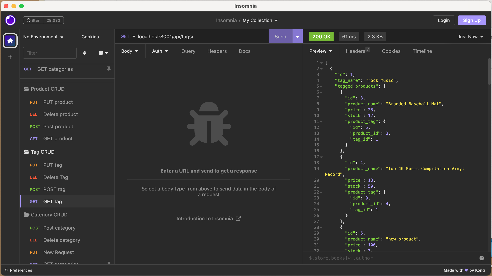

# E-commerce Back End

## Description
  Internet retail, also known as e-commerce, is the largest sector of the electronics industry, having generated an estimated US$29 trillion in 2017 (Source: United Nations Conference on Trade and Development). E-commerce platforms like Shopify and WooCommerce provide a suite of services to businesses of all sizes. Due to the prevalence of these platforms, developers should understand the fundamental architecture of e-commerce sites.

  This is a back-end application for an e-commerce site where all CRUD operations can be tested using Insomnia Core. I configured a working Express.js API to use Sequelize to interact with a MySQL database.

## Table of Contents
  - [Installation](#installation)
  - [Usage](#usage)
  - [Credits](#credits)
  - [Features](#features)
  - [Tests](#tests)
  - [License](#license)

  ## Installation
  Clone the respository from the repo in GitHub. Make sure you install Node.js and NPM on your computer. You will need to use MySQL2, Sequelize, Express and dotenv. Run `npm install` to install the required dependencies.

  ## Usage
  You can find the walkthrough video here - [ecommerce walkthrough video](https://drive.google.com/file/d/1fOZdtjZeqITRBuBOR-3y7jsqdmeZeHza/view?usp=share_link)

  
  
  
  

  Start by opening the file in the terminal. Make sure you use the environment to update your MySQL username and password. Run `mysql -u root -p` to initialize MySQL, then type your password to login. Run `source db/schema.sql` to load the database and then `npm run seed` to seed data to your database. Run `npm start` to start the server and use Insomnia Core to test the API routes. 

  

## Credits
Starter code from [Coding Boot Camp](https://github.com/coding-boot-camp/fantastic-umbrella)
  

## Features
* Node.js
* Express.js
* MySQL2
* dotenv
* Sequelize
* Insomnia Core

## Tests 
Use incomnia Core to test the routes

## License
The project is licensed under MIT. For more information, please refer to the LICENSE in the repo.
  

